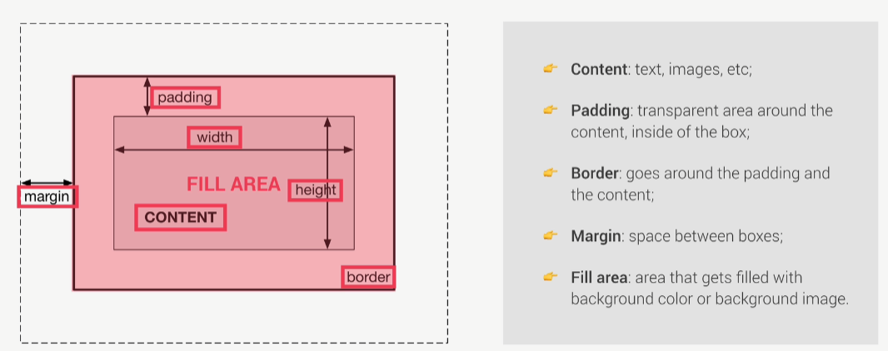

### All content goes in the body.
```Html
<body>
    <h1>This is a test</h1>
    <p>Another Test</p>
</body>
```
### All settings, title, link, etc goes in the head:
```Html
<head>
    <meta charset="UTF-8">
    <meta name="viewport" content="width=device-width, initial-scale=1.0">
    <link rel="stylesheet" href="Style.css">
    <title>Learning HTML & CSS</title>
</head>
```

### Use div to create empty boxes that contain content
```Html
<div>
    <h1>Will be shown in an invisible box that can be manipulated</h1>
</div>
```

### Use form to create an empty box that takes in an input
```Html
<form id="your_name">
    <h2>Your name here</h2>
    <p class="first">Please fill in this form</p>
    <input type="text" placeholder="Your name">
    <button>Ok!</button>
</form>
```

### Id's can only be used once (another id cannot have the same name); Use classes for multiple objects and id's for single objects


### CSS Box Model


### Use *{} to modify all elements on a page
```CSS
* {
    margin: 0;
    padding: 0;
    box-sizing: border-box; /*Always use border-box because it allows the width to be unaffected by padding*/
}
```

### Use .classname to access classes in css
```CSS
.first {
    color: blue;
}
```

### Use #idname to access id's
```CSS
#your_name {
    background-color: orange;
    border: 5px solid #444;
}
```

### Use p{} to mofidy all paragraph elements on the page
```CSS
p {
    margin-bottom: 20px;
}
```

### Use a{} to modify all hyperlinks
```CSS
a {
    background-color: yellowgreen;
}
```
### Selecting child classes/ids/objects (call the parent (#your_name) then the child (h2))
```CSS
#your_name h2 {
    color: olivedrab;
}
``` 

### console.log() to print in the console.

### use const when variable not supposed to change and let when it will change

### Template Literals
```JavaScript
//Encase string with ` ` to use template literals
//Use ${variable name} to insert variables in the string
const adam_new = `I'm from ${country}, which is in ${contient}`
```

### Type conversion
```JavaScript
const my_number = "1"
console.log(my_number + 1) //Would print 11
console.log(Number(my_number) + 1) //Would print 2
console.log(String(0)) //Would print "0"
```

### === vs ==
```JavaScript
 18 === 18 // --> true
 18 === "18" // --> false
 18 == "18" // --> true
 //== does type coercion
```
### Use prompt to get user input (appears in a similar box to alert)
```JavaScript
const favorite_number = Number(prompt(`What's your favorite number?`))

if (favorite_number > 1){
    console.log(`Is greater than 1`)
}else{
    console.log(`Is not greater than 1`)
}
```

### Logical operators
```JavaScript
// && --> and
// || --> or
// !{boolean} --> not 
//