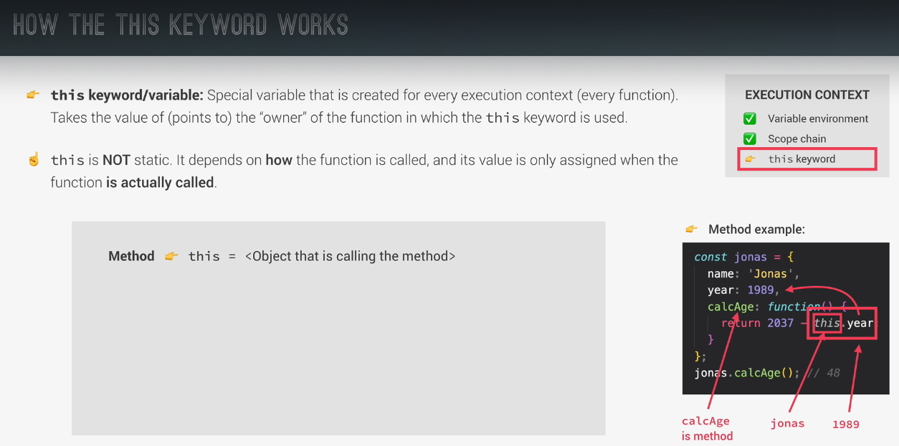
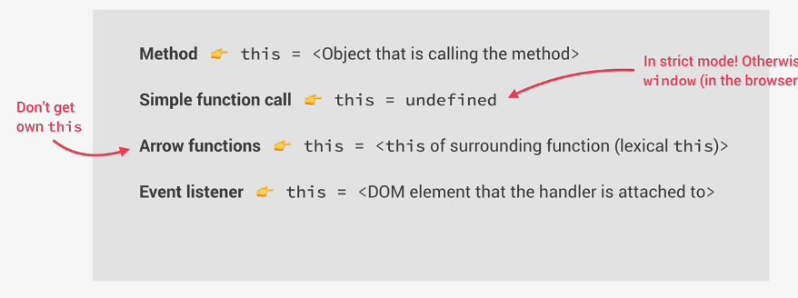

## Always use strict mode, it helps to catch errors

```JavaScript
"use strict";
```

```JavaScript
console.log() //print
```

## use const when variable not supposed to change and let when it will change

## Template Literals

```JavaScript
//Encase string with ` ` to use template literals
//Use ${variable name} to insert variables in the string
const adam_new = `I'm from ${country}, which is in ${contient}`
```

## Type conversion

```JavaScript
const my_number = "1"
console.log(my_number + 1) //Would print 11
console.log(Number(my_number) + 1) //Would print 2
console.log(String(0)) //Would print "0"
```

## === vs ==

```JavaScript
 18 === 18 // --> true
 18 === "18" // --> false
 18 == "18" // --> true
 //== does type coercion
```

## Use prompt to get user input (appears in a similar box to alert)

```JavaScript
const favorite_number = Number(prompt(`What's your favorite number?`))

if (favorite_number > 1){
    console.log(`Is greater than 1`)
}else{
    console.log(`Is not greater than 1`)
}
```

## Logical operators

```JavaScript
// && --> and
// || --> or
// !{boolean} --> not
```

## Switch Statement, another form of if/else statement

```JavaScript
const day = "Monday";

switch (day) {
    case "Monday":
        console.log("The day is Monday");
        break;
    case "Tuesday":
        console.log("The day is Tuesday");
        break;
    case "Wednesday":
    case "Thursday":
        console.log("The day is either Wednesday or Thursday");
        break;
    case "Friday":
        console.log("The day is Friday");
        break;
    case "Saturday":
    case "Sunday":
        console.log("It is either Saturday or Sunday");
        break;
    default:
        console.log("No day of the week was entered!");
        break;
}
```

## Ternary Operator - For quick if else checking, use ? after the expression then [code to run if true] : [code to run if false]

```JavaScript
const age = 24

age >= 18 ? console.log("Adult") : console.log("Child")
```

## Array Methods:

```JavaScript
array.push(item) //adds the item next to the last index in the array AND returns the new length of the array if stored in a variable.
array.unshift(item) //adds the item to the first index in the array AND returns the new length of the array if stored in a variable.
array.shift(item) //removes the first index of the array and returns the value if stored in a variable.
array.pop() //removes the last index of the array and returns the value if stored in a variable.
array.indexOf(item) //returns index of the item.
array.includes(item) //returns a boolean whether the item was found within the array.
```

## Dictionary:

```JavaScript
const adam = {
    first_name: "Adam",
    last_name: "Cooper",
}
```

## To reference HTML elements via JS, use:

```JavaScript
document.querySelector(".class"/"#id")
```

## Scoping


## This Keyword

Using "this" in a method:


All Uses:



## Shallow cloning an object (deeply nested objects within an object are cloned however if manipulated, the original object will also be affected)

```JavaScript
const jessica = {
    firstName: "Jessica",
    lastName: "Williams",
    family: ["Alice", "Bob"] //This is an example of a deeply nested object that will be changed in both objects if manipulated.
}

const jessicaCopy = Object.assign({}, jessica); //Shallow clones the object into a blank object (jessica --> {})

jessicaCopy.lastName = "Davis"; //Will only change in the jessicaCopy object

jessicaCopy.family.push("Mary"); //Adding marry to jessica copy's family will also add it to the original jessica object.

```

## Destructuring Arrays

```JavaScript
const restaurant = {
  name: "Classico Italiano",
  location: "Via Angelo Tavanti 23, Firenze, Italy",
  categories: ["Italian", "Pizzeria", "Vegetarian", "Organic"],
  starterMenu: ["Focaccia", "Bruschetta", "Garlic Bread", "Caprese Salad"],
  mainMenu: ["Pizza", "Pasta", "Risotto"],

  Order: function (starterIndex, mainIndex) {
    return [this.starterMenu[starterIndex], this.mainMenu[mainIndex]];
  },
}

let [main, , secondary] = restaurant.categories; //The , , means to skip an index

console.log(`Main: ${main}, Secondary: ${secondary}`); //Prints main = "Italian" and secondary = "Vegetarian"

[main, secondary] = [secondary, main]; //Switches the order from "Italian" "Vegetarian --> "Vegetarian" "Italian"

console.log(`Main: ${main}, Secondary: ${secondary}`); //Prints main = "Vegetarian" and secondary = "Italian"

const [starter, mainCourse] = restaurant.Order(2, 0); //Storing multiple returned values into an array.

console.log(starter, mainCourse); //Prints "Garlic Bread" and "Pizza"

const nested = [2, 4, [5, 6]];

const [i, , [j, k]] = nested; //Skips the four and stores the appropriate values

console.log(i, j, k); //Prints 2, 5, 6
```

## Destructuring Objects

```JavaScript
const restaurant = {
  name: "Classico Italiano",
  location: "Via Angelo Tavanti 23, Firenze, Italy",
  categories: ["Italian", "Pizzeria", "Vegetarian", "Organic"],
  starterMenu: ["Focaccia", "Bruschetta", "Garlic Bread", "Caprese Salad"],
  mainMenu: ["Pizza", "Pasta", "Risotto"],

  openingHours: {
    thu: {
      open: 12,
      close: 22,
    },

    fri: {
      open: 11,
      close: 23,
    },

    sat: {
      open: 0, // Open 24 hours
      close: 24,
    },
  },
};

const { name, openingHours, categories } = restaurant; //Unlike arrays, the order does not matter, the variable names should match the object's variable name.

console.log(name, openingHours, categories); //Prints "Classico Italiano", {thu: {}, fri: {}, sat: {}}, ["Italian", "Pizzeria", etc...]


const {
  name: restaurantName, //The colon after the variable name allows for re-naming so when accessing the variables, the assigned names are used.
  openingHours: hours,
  categories: tags,
} = restaurant;

console.log(restaurantName, hours, tags); //Still prints "Classico Italiano", {thu: {}, fri: {}, sat: {}}, ["Italian", "Pizzeria", etc...]

const {fri: { open, close }} = openingHours;

console.log(open, close); //Prints 11 and 23
```

## Destructuring Objects in Function Parameters

```JavaScript
//Unpacking the object using correct naming like in the example above allows for the parameter order to be ignored.

//Adding the "=" after a variable when destructuring sets the default value for that variable in the event that it cannot be destructured (for example if a value is undefined). Which means that if the starterIndex was not provided, the value of the parameter in the function would be the default value of 1.

function OrderDelivery ({ starterIndex = 1, mainIndex = 0, time, address }) {
  console.log(starterIndex);
},

OrderDelivery({ //The variables do not match the function parameters however it is still passed
  time: "22:30",
  address: "Via del Sole, 21",
  mainIndex: 2,
  starterIndex: 2,
});
```

## The Spread Operator(...) and Rest Pattern

```JavaScript
const arr = [7, 8, 9];
const newArr = [1, 2, ...arr];

console.log(newArr); //Prints the array: [1, 2, 7, 8, 9]

console.log(...newArr); //Prints the contents of the array separately: 1 2 7 8 9

//The spread operator works with all iterables(arrays, strings, maps, sets, etc)

//Breaking down a string
const myName = "Adam"

const myNameLetters = [...myName] //Saves each letter into the array separated by commas

console.log(myNameLetters) //Prints ["A", "d", "a", "m"]
console.log(...myName) //Prints A d a m

//Using spread operator in a function with multiple parameters
const restaurant = {
  OrderPasta: function (ing1, ing2, ing3) {
    console.log(
      `Here is your delicious pasta with ${ing1}, ${ing2}, and ${ing3}`
      );
  },
}

//Prompt the user for input
const ingredients = [
  prompt("Let's make pasta! Ingredient 1?"),
  prompt("Let's make pasta! Ingredient 2?"),
  prompt("Let's make pasta! Ingredient 3?"),
];

restaurant.OrderPasta(...ingredients); //Unpacks the 3 ingredients in the array and provides them as the 3 required parameters.

//------Rest Pattern------

// In Destructuring:
const names = ["Adam", "Bob", "Barry", "Lola", "Cassandra"]

const [myName, ...otherNames] = names;

console.log(myName, otherNames) //Prints Adam separately and an array with ["Bob", "Barry", "Lola", "Cassandra"]

//In Functions:
//...numbers packs all of the arguments into an array
function add(...numbers){
let sum = 0

for (let i = 0; i < numbers.length; i++) {
  sum += numbers[i]
}

console.log(sum);
}

add(2, 3) //Prints 5

const x = [1, 2, 3]

add(...x)//Unpacks all elements and provides them as individual arguments printing 5
```

## Short Circuiting

```JavaScript
//The OR operator (||) will return the first truthy value of all the operands or the last value if all are falsy.
console.log("" || "Adam") //Prints Adam
console.log(true || 0) //Prints true

//The AND operator (&&) will return the first falsy value of all operands or the last value if all are truthy.
console.log(0 && "Adam") //Prints 0
console.log(7 && "Adam") //Prints Adam
```

## Nullish Coalescing Operator

```JavaScript
const myGuest = 0;

const guests = myGuest || 10;

console.log(guests); //Prints 10 because 0 is a falsy value.

//However, if we want to check only if the variable exists regardless if it is falsy or not, we can use the nullish coalescing operator.

const guestCorrect = myGuest ?? 10;

console.log(guestCorrect); //Prints 0 if myGuest exists or 10 if the variable is null/undefined.
```

## for-of loop and .entries()

```JavaScript
const menu = ["Focaccia", "Bruschetta", "Garlic Bread", "Caprese Salad", "Pizza", "Pasta", "Risotto"]

//-------Example 1---------
/*
The code below prints each of the items in the array separately:

Focaccia
Bruschetta
Garlic Bread
Caprese Salad
Pizza
Pasta
Risotto
*/

for (const item of menu) {
  console.log(item);
}


//--------Using .entries()---------------
/*
If we want the index of the element, we use .entries() on the array which puts each item into their own array with their original indexes
[ 0, 'Focaccia' ]
[ 1, 'Bruschetta' ]
[ 2, 'Garlic Bread' ]
[ 3, 'Caprese Salad' ]
[ 4, 'Pizza' ]
[ 5, 'Pasta' ]
[ 6, 'Risotto' ]
*/

for (const item of menu.entries()) {
  console.log(item);
}

//--------Using destructuring with .entries()---------------
/*
We can separate the index and the element into separate variables via destructuring. This is the equivalent to a for i, v in pairs() loop in the Lua programming language. Which would print the following:

1: Focaccia
2: Bruschetta
3: Garlic Bread
4: Caprese Salad
5: Pizza
6: Pasta
7: Risotto

NOTE: The first element didn't start from 0 in the printed result because in the loop, we added 1 to the index for more accurate display.
*/

for (const [index, foodName] of menu.entries()) {
  console.log(`${index + 1}: ${foodName}`);
}

```

## Optional Chaining

```JavaScript
//If we are checking if a property exists, instead of using if statements, we can use optional chaining.

const restaurants = {
  openingHours: {
    wednesday: {open: 12, close: 6}
    thursday: {open: 9, close: 11},
    friday: {open: 2, close: 7},
  },

  SaySomething: function(something){
    console.log(something);
  }
}

/*This would be useful in cases of using an API since the data isn't hardcoded so a lot of checking would have to be done.
Instead of writing if(openingHours && openingHours.monday){...}, we can write:
*/

console.log(restaurant.openingHours?.mon?.open); //This would print undefined

/*The "?" checks the existence of all elements before it. If an element does not exist, "undefined" would be returned instead of proceeding. Without this optional chaining, we would receive an error because: monday is already undefined and trying to access an property of an undefined element results in a error.*/

//The same can be used on Methods:
console.log(restaurant.SaySomething?.("Hello World!") ?? "Method does not exist"); //This would print Hello World!
console.log(restaurant.RandomPhrase?.("Hello World!") ?? "Method does not exist"); //This would print Method does not exist

//As well as Arrays:
let users = [{ name: "jonas", email: "blalalal@gmail.com" }];

console.log(users[0]?.name ?? "Empty"); //Prints Jonas

users = []

console.log(users[0]?.name ?? "Empty"); //Prints Empty

//----------------------Extra Tip-------------------------
//Fun fact: This can be combined with the Ternary Operator:
console.log(restaurant.openingHours?.mon?.open ? "Exist" : "Doesn't Exist"); //Will print Doesn't exist.
```

## Looping Objects

```JavaScript
const restaurants = {
  openingHours: {
    wednesday: {open: 12, close: 6}
    thursday: {open: 9, close: 11},
    friday: {open: 2, close: 7},
  },
}


const days = Object.keys(restaurant.openingHours); //Creates an array and inserts all of the keys of the object provided
for (const day of days) {
  console.log(day); //Prints wednesday thursday friday
}

//We can alternatively use Object.values(restaurant.openingHours) if we need the values.

const entries = Object.entries(restaurant.openingHours);
console.log(entries); //This prints an array containing arrays that contain each key and value pair:
/*
[
  [ 'thu', { open: 12, close: 22 } ],
  [ 'fri', { open: 11, close: 23 } ],
  [ 'sat', { open: 0, close: 24 } ]
]
*/

//We can take this a step further with destructuring:
for (const [key, { open, close }] of entries) {
  console.log(key, open, close);
}

/*Which would print:
thu 12 22
fri 11 23
sat 0 24
*/
```

## Sets

```JavaScript
const ordersSet = new Set(["Pizza", "Pasta", "Pizza", "Risotto"]); //A set only hold unique data

console.log(ordersSet); //Will print {"Pizza", "Pasta", "Risotto"}; The second pizza value is removed

console.log(ordersSet.has("Bread")); //Similar to array.includes(), this checks if an item is inside of a set.

ordersSet.add("Garlic Bread");//The equivalent to array.push(); adding an item to the set

ordersSet.delete("Risotto")//Deletes the element within the set.

console.log(ordersSet); //Will print {"Pizza", "Pasta", "Garlic Bread"}; Added Garlic Bread and deleted Risotto.

ordersSet.clear() //Removes all elements in the set.

```

## Maps

```JavaScript
const rest = new Map(); //Creates the map

rest.set("Name", "Classico Italiano"); //Take 2 inputs: Key, Value; Then puts them into the set.
rest.set(1, "Rome, Italy"); //The key can be any type, boolean, number, string, etc.
console.log(rest.set(2, "Lisbon, Portugal")); //When we call map.set(), not only is the pair added, but the map is also returned. This will print:

/*
Map(3) {
  'Name' => 'Classico Italiano',
  1 => 'Rome, Italy',
  2 => 'Lisbon, Portugal'
}
*/

//We can also create sets by using nested arrays:
const question = new Map([
  ["question", "What is my name?"],
  [1, "Adam"],
  [2, "Bob"],
  [3, "Fred"],
  ["correct", 1],
  [true, "Correct!"],
  [false, "Try again!"],
]);

/*
Which will print:
Map(7) {
  'question' => 'What is my name?',
  1 => 'Adam',
  2 => 'Bob',
  3 => 'Fred',
  'correct' => 1,
  true => 'Correct!',
  false => 'Try again!'
}
*/

//To retrieve values, we use Map.get(key).
console.log(rest.get("Name")); //Will print Classico Italiano

//With booleans as keys, we can do things like this:
rest.set(false, "This is false!");
console.log(rest.get(0 > 1)); //Since 0 is not greater than 1, false is passed as the value and This is false! is printed.

//We can check if a map has a certain key using:
console.log(rest.has("categories")); //Prints false.

//We can remove key, value pairs using rest.delete(key):
rest.delete("Name");

//We can check the size of a map using:
console.log(rest.size)

//Maps can even store arrays as keys. HOWEVER, the array needs to be stored in a variable. When using rest.get() on an array, we are accessing it through it's address in the Heap, not it's specific value.

rest.set([1, 2], "Hello World")

console.log(rest.get([1, 2])) //NOTE: This will print undefined because both arrays are not the same object in the heap.

//We should do this instead:

const myArray = [1, 2]

rest.set(myArray, "Hello World");

console.log(rest.get(myArray)); //Will print Hello World because we accessed the object directly through its address.

//----------UNIQUE TIP----------
//Since Maps are created with nested arrays. We can create maps with Object.entries()
const restaurant = {
  openingHours: {
    wednesday: {open: 12, close: 6}
    thursday: {open: 9, close: 11},
    friday: {open: 2, close: 7},
  },
}

const anotherMap = new Map(Object.entries(restaurant.openingHours))

/*
Which would print:
Map(3) {
  'wednesday' => { open: 12, close: 22 },
  'thursday' => { open: 11, close: 23 },
  'friday' => { open: 0, close: 24 }
}
*/


//----------------Iterating Over Maps-------------------
//We can iterate over maps the same way as we do when destructuring an object in a for loop:

for (const [key, value] of question) {
  console.log(key, value);
}

//Also similar to objects, we can call map.keys() and map.values()
```

## String Manipulation

```JavaScript
let myString = "Adam";

myString.indexOf(/*string*/) //Returns the index where the letter/word was found
myString.slice(/*index*/) //Splits the string and returns the resulted string after the index provided.
myString.toLowerCase()
myString.toUpperCase()
myString.trim() //Removes whitespace in the string
myString.replace(/*string to replace*/, /*new string*/)
```
