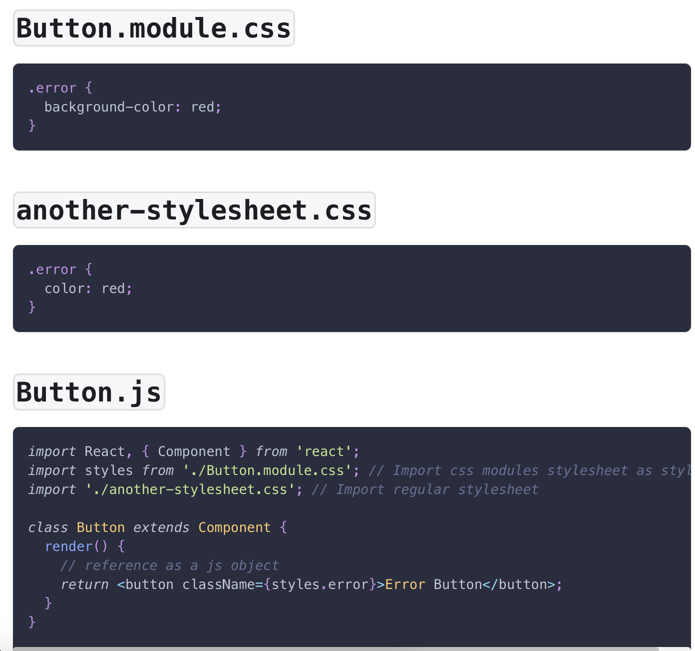

## Components

React is built with components that are functions to be exported into other components or the main app.

Components are usually stored in their own .jsx file to keep everything neat.

#### Post.jsx (exporting component)

```JSX
function Post() {
  return (
    <li>
      <p>Adam Cooper</p>
      <p>Hello my name is actually Bob</p>
    </li>
  );
}

export default Post;
```

#### App.jsx (importing the previous component)

```JSX
import Post from "./Post";

function App() {
  return (
    <>
      <Post />
    </>
  );
}
```

## Fragments

In a react component, only 1 root element must be returned so we contain everything in a fragment

```JSX
function PostList(props) {
    //The <> and </> is the fragment
  return (
    <>
      <NewPost />
      <ul className={classes.posts}>
        <Post author="Adam" body="React.js is awesome" />
        <Post author="Stefaniya" body="My name is Stefaniya Tovstik" />
      </ul>
    </>
  );
}
```

## Props

Props are essentially parameters that can be added to a react component so that when the component is called, arguments/props can be passed in

#### Post.jsx

```JSX
function Post(props) {
  return (
    <li>
      <p>{props.author}</p>
      <p>{props.body}</p>
    </li>
  );
}
```

#### App.jsx

```JSX
function App() {
  return (
    <>
    <Post author="Adam" body="React.js is awesome" />
    <Post author="Stefaniya" body="My name is Stefaniya Tovstik" />
    </>
  );
}
```

## Modules

CSS Modules let you use the same CSS class name in different files without worrying about naming clashes For example, if we imported 2 different .css files that both have a .body class. We use modules to specify which css style we want to use.

- To create a module, we create a module.css file using this convention: [name].module.css



From the picture, the .error style was imported by importing styles(can be named anything) from the Button.module.css file and then called by using className={styles.error} so that the .error from another-stylesheet.css was not used.

## States

In order for react components to be updated dynamically(live), we have to use the useState hook from react.

```JSX
//We first import the useState hook
import { useState } from "react";
import classes from "./NewPost.module.css";

function NewPost() {
    //The useState hook stores an array with 2 elements, the first element is the initial value that is stored in the state, in this case, [0] = "". The second element is the function that allows for the first element to be updated and we can give that function any name we choose. Where here, [1] = SetEnteredBody. We store these elements usually by destructuring.
  const [enteredBody, SetEnteredBody] = useState("");

  //Now lets say that I want to dynamically update some text when something is typed into a text box, we create a function inside of the component and use the function stored in the useState array at [1] to do this. We pass in the value that we want [0] to be updated to.
  function ChangeBody(event) {
    //Setting the enteredBody variable ([0] in the useState array)above to the new event value. This function is called below from the onChange event that fires every time the textarea is modified.
    SetEnteredBody(event.target.value);

    //This SetEnteredBodyFunction recalls the NewPost component but only re-renders the modified elements which saves performance.
  }

  return (
    <form className={classes.form}>
      <p>
        <label htmlFor="body">Text</label>
        <textarea id="body" required rows={3} onChange={ChangeBody} />
      </p>
      <p>{enteredBody}</p>
      <p>
        <label htmlFor="name">Your name</label>
        <input type="text" id="name" required />
      </p>
    </form>
  );
}

export default NewPost;

```

## API Calls -> Axios

We can use Axios to manage our API calls.
